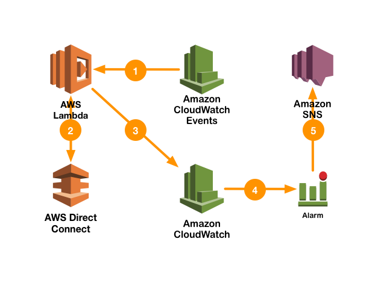

# aws-dx-monitor

The purpose of ***aws-dx-monitor*** is enabling  customers to monitor [AWS Direct Connect](https://aws.amazon.com/directconnect/) runtime configuration items with [Amazon CloudWatch](https://aws.amazon.com/cloudwatch/). The system is driven by [Amazon CloudWatch Events](http://docs.aws.amazon.com/AmazonCloudWatch/latest/events/WhatIsCloudWatchEvents.html) and [AWS Lambda](https://aws.amazon.com/lambda/).  

## How it works

The following diagram expresses the high level system execution architecture.

1.	CloudWatch Events schedules and invokes the Lambda function at five minute intervals.
2.	The Lambda function interrogates the AWS Direct Connect service through Describe API calls for every configuration type that makes sense for its operational scope (for example, if you are a Service Provider, you may wish to describe the Interconnects). AWS Direct Connect responds with the JSON payloads for each Describe call.
3.	After the Lambda function extracts the status from a given configuration item, it puts the data to a CloudWatch Custom Metric.  Each configuration item type should have its own dimension in order to easily identify what is being monitored.
4.	Once the data has been settled in the custom CloudWatch metric, you can set alarms for it.  See the section on Status Levels for information on configuration item status levels.
5.	Alarms may be triggered to notify an operator or administrator of a monitored status threshold.

## Installation

Use the following steps to build and deploy the system.  It is strongly suggested that you review the security policies prior to deploying to your environment. 

### 1. Prerequisites

On the system where you will be building the AWS Lambda package, you will need the following:

- git
- python 2.7

### 2. Clone the Repository

Clone this repository.

~~~sh
$ git clone https://github.com/awslabs/aws-dx-monitor
~~~

### 3. Build the aws-dx-monitor Package

Build the aws-dx-monitor package.  The script downloads the `Enum` backport for Python 2.7 and will bundle it as part of the resulting package.

~~~sh
$ cd aws-dx-monitor
$ pip install enum34 -t .
$ python package.py
~~~

### 4. Deploy the AWS Lambda Function

Deploy the AWS Lambda function.  The function must be deployed to every region where you have AWS Direct Connect connections.

1. Login to the AWS Console.
2. Select Services > Lambda
3. Click **Create a Lambda Function**
4. In *Select Blueprint*, click **Skip**
5. In *Configure triggers*:
  1. Click the empty box, and select **CloudWatch Events - Schedule**.
  2. For **Rule name**, enter **aws-dx-monitor**.
  3. For **Rule description**, enter **Monitor Direct Connect status**
  4. For **Schedule expression**, select **rate(5 minutes)** (or 1 minute if you desire)
  5. Click the **Enable trigger** checkbox.
  6. Click the **Next** button.
6. In *Configure function*:
  1. For **Name**, enter **aws-dx-monitor**
  2. For **Description**, enter **Monitor Direct Connect status**
  3. For **Runtime**, select **Python 2.7**
  4. For **Code entry type**, select **Upload a .ZIP file**
  5. For **Function package**, click the **Upload** button, and select the package you built in the previous section named `aws-dx-monitor.zip`.
  6. For **Hander**, ensure the value is `aws-dx-monitor.lambda_handler`.
  7. For **Role**, select **Create a custom role**.
     1. For **IAM Role**, select Create a new IAM Role.
     2. For **Role Name**, enter **aws-dx-monitor-role**
     3. Expand **View Policy Document** and click the **Edit** link.  When the Edit Policy dialog appears, click **OK**.
     4. Enter the policy defined in the section [Lambda Execution Policy](#lambda-execution-policy).  **Review the policy prior to using**.
     5. Click **Allow**.     	
  8. Click the **Next** button.
9. Click **Create Function**.

### 5. Set Alarms

Once the scheduled event begins sending data to Amazon CloudWatch, you can begin setting alarms.  The custom metric will be found in CloudWatch > Metrics under the name ***AWSx/DirectConnect***.  For more information, see [Creating Amazon CloudWatch Alarms](http://docs.aws.amazon.com/AmazonCloudWatch/latest/monitoring/AlarmThatSendsEmail.html).

You may wish to alarm on these levels:

| Config Item                 | Level |
|:----------------------------|:------|
| Connection                  | >= 5  |
| Interconnect                | >= 4  |
| Connections on Interconnect | >= 5  |
| Virtual Interface           | >= 5  |
| Virtual Gateway             | >= 3  |

# Status Levels

See the following sections for status levels on:

- Connections
- Interconnects
- Connections on Interconnects
- Virtual Interfaces
- Virtual Gateways

### Connections

| Name        | API Status Value | Numeric Value |
|:------------|:-----------------|:--------------|
| Ordering    | ordering         | 1             |
| Requested   | requested        | 2             |
| Pending     | pending          | 3             |
| Available   | available        | 4             |
| Down        | down             | 5             |
| Deleting    | deleting         | 6             |
| Deleted     | deleted          | 7             |
| Rejected    | rejected         | 8             |

### Interconnects

| Name        | API Status Value | Numeric Value |
|:------------|:-----------------|:--------------|
| Requested   | requested        | 1             |
| Pending     | pending          | 2             |
| Available   | available        | 3             |
| Down        | down             | 4             |
| Deleting    | deleting         | 5             |
| Deleted     | deleted          | 6             |

### Connections on Interconnects

| Name        | API Status Value | Numeric Value |
|:------------|:-----------------|:--------------|
| Ordering    | ordering         | 1             |
| Requested   | requested        | 2             |
| Pending     | pending          | 3             |
| Available   | available        | 4             |
| Down        | down             | 5             |
| Deleted     | deleted          | 6             |
| Rejected    | rejected         | 7             |
### Virtual Interfaces

| Name        | API Status Value | Numeric Value |
|:------------|:-----------------|:--------------|
| Confirming  | confirming       | 1             |
| Verifying   | verifying        | 2             |
| Pending     | pending          | 3             |
| Available   | available        | 4             |
| Down        | down             | 5             |
| Deleting    | deleting         | 6             |
| Deleted     | deleted          | 7             |
| Rejected    | rejected         | 8             |

### Virtual Gateways

| Name        | API Status Value | Numeric Value |
|:------------|:-----------------|:--------------|
| Pending     | pending          | 1             |
| Available   | available        | 2             |
| Deleting    | deleting         | 3             |
| Deleted     | deleted          | 4             |

# Lambda Execution Policy

This policy allows:

- Read-only access to AWS Direct Connect
- PutMetricData access to Amazon CloudWatch
- Log write access to CloudWatch Logs for Lambda logging.

~~~json
{
    "Version": "2012-10-17",
    "Statement": [
        {
            "Effect": "Allow",
            "Action": [
                "directconnect:DescribeConnections",
                "directconnect:DescribeConnectionsOnInterconnect",
                "directconnect:DescribeInterconnects",
                "directconnect:DescribeVirtualGateways",
                "directconnect:DescribeVirtualInterfaces"
            ],
            "Resource": "*"
        },
        {
            "Effect": "Allow",
            "Action": [
                "cloudwatch:PutMetricData"
            ],
            "Resource": "*"
        },
        {
            "Effect": "Allow",
            "Action": [
                "logs:CreateLogGroup",
                "logs:CreateLogStream",
                "logs:PutLogEvents"
            ],
            "Resource": "arn:aws:logs:*:*:*"
        }
    ]
}
~~~
